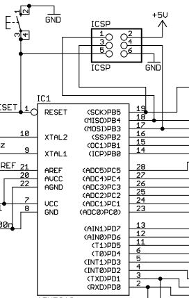

##ATmega 328
###Components
1. CPU - 8 bit AVR
2. External Interrupts - 24
3. SPI - 2
4. I2C - 1
5. UART - 1
6. ADC Channels - 8
7. Analog Comparators - 1
8. Timers - 3
9. Output Compare Channels - 6
10. Input Capture Channels - 1
11. PWM channels - 6
12. Watchdog    

###Memory Map
###Instructions
###I/O Ports Registers
Every port has three register bit.
 * DDxn
 * PORTxn
 * PINxn

DDxn is accessed at DDRx i/o Address.  
PORTxn is accessed at PORTx i/o Address.  
PINxn is accessed at PINx i/o Address. 

If DDx is 1 this implies that the pin is output pin and if DDx pin is 0 then it is input pin.  
When DDx is 0 , if PORTx is 1 then pull up resisitor is activated. It can be deactivated either when DDx is 1 or when PORTx is 0.  

If PORTx is when when DDx is 1 then the pin is driven high and if PORTx is 0 then the pin in driven low.  

If PINx is 1 , it toggles the value of PORTx irrespective of the value of DDx.  

###Interrupts

###Connections for Atmega328

