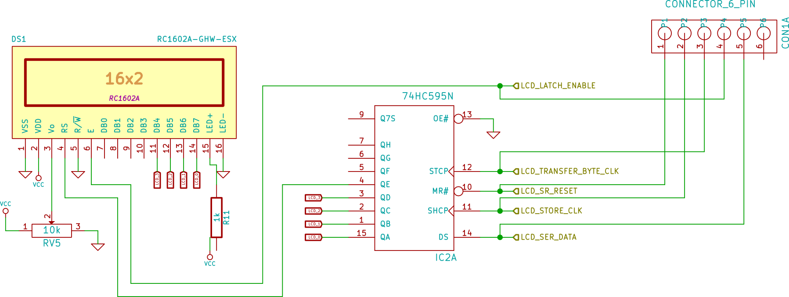

#Training Report (Summer 2015, Abhinav Ghai)

##Organization Overview

###About Organization

da Kine Technologies pvt. ltd. (DKTPL), started in 2010. It started with an idea to create a product in education which can help connect tutors to remote students. Later it ventured into various other projects and products in the domain of automation - ERP, CRM and System Solutions. Embedded is one of the important aspects to connect to the data sensing and control components of the solutions offered.

###Technologies

DKTPL current focus area is internet technologies, though the abilities cover quite a vast area in terms of creating a full-fledged solution with knowledge of electronics and software. In their projects, they use different frameworks like PhoneGap, Ionic, Android - SDK, NodeJs, AngularJs and several other frameworks from PHP to create solutions for small businesses to manage their resources, delivering services.

###Products

DKTPL is a research and development organization, enaged in creating products that enable SME (small and medium scale industries) to automate e.g. ComLiive (customer - vendor networking solution), dietician providing diet services through mobile apps, automation solutions around micro-controllers.

##Synopsis of Training
6 weeks of training at DKT enabled exposure to mix of software and hardware practical knowledge. During this period, there were couple of visits to Industries to see use of electronics and software. Electronics and software are interdependent disciplines and together serve several industries, via control systems, data sensing, data recording, analysis. Electronics enables the capturing, access to the real world, while software is much bigger pie as it explores various possibilities of application of data and controls on the same hardware.

Electronics advances in low powered devices, smaller footprints and revolution in addressability is enabling to dumb physical devices like watches, shoes as intelligent devices. Software is able to reach and collect data from remotest possible items that human being may be using. This is generating exabytes of data and hence throwing lot of information which is being analysed through advanced statistical techniques using software to make predictions and optimizations in operations.

Knowledge in C-Language and digital electronics was mostly used in the training and further strengthened while trying to implement new things. Logical reasoning and conceptualising / doing things on paper is key to design and solving problems using software and hardware.

Traffic Lights was a project used as a means to get exposed to all the ground level work for creating systems. We started from experimenting with individual components, integrating them as single system and evolving software to deal with complex situations. It was interesting to see, how things can become complex from seemingly a simple solutions.

Overall, world of software and hardware, when fused together to open new world of possibilities is quite exciting. For me it is just a beginning.

##Learnings - Software

### Learning - Linux
[Click here](learning_linux.md)
### Make Utility
[Click here](learning_linux.md)

### Object Oriented Design

[Click here](oops.md)

#### Example Testing Code

##Learnings - Electronics

### Learning ATMEL328 Controller
[Click here](learning_atmega8.md)

### Learning 8051 Controller

### Learning AM335

### Learning Peripherals

**74HC595 - Serial in Paralle Out shift register**

**UART Chip**

**ULN2003 - Motor Driver**

##Learnings - Processes

##Learnings - New Technologies

### Internet of things

### High Speed Networks

##Learnings - Visit to Industries

### Factories visited

### Processes and Automation

### Scope of electronics and software in operations

##Learnings - Procurement

Following steps followed:

+ Solution Design
+ Prepare Bill Of Materials
+ Vendor Selection - research through internet and other known sources
+ In-Market research for costly items
+ Procurement
+ Components Entry / Management in ERP

##Learnings - CAD Design

KiCAD is an open source software on Ubuntu, which can be used for schematic design, routing PCB and sending the gerber files to manufacturer for getting the developed PCBs.

**TODO:** Capture various features within schematic design that you have learnt.

##Project - Traffic Lights

### Problem Statement
**Implement a logic for traffic lights of square.**  
Suppose there

### Solution Overview


### Schematic Diagram

### Snap of actual circuitry

#### Working on breadboard


#### Working on PCB, hard-wired
#####Circuit for ATMega328

#####Circuit for Traffic Sensor

#####Circuit for LCD

#####Circuit for Traffic Lights

#####Circuit for Power Regulator

#####Circuit for Motor Control to simulate traffic

### Extracts of code and explanation
#### Pushing data to shift register
```c
void shiftOutClockedData(unsigned int dat1) {
     unsigned int i, opser, srclk=0;
     unsigned int data = 0xFFFF - dat1;
    for(i=0;i<16;i++) {
      
      digitalWrite(8, data & 0x01);
      data = data >>1;
      digitalWrite(13, HIGH); 
      digitalWrite(13, LOW); 
    }
}
```

```c
if(tState & 0x02) {/*Yellow is on*/
        delay(duration[1]);
        startingState = (startingState & ~(0x0F << i*4)) | (0x04 << i*4) ;
       ...
} 
```

```
 if(i == 3) {
         /* Glow yellow led for 0th pole*/
         startingState = (startingState & ~0x0F) | (0x09) ;
       } else {
         /* Glow yellow led for next pole in sequence */
         startingState = (startingState & ~(0x0F << ((i+1)*4))) | (0x09 <<( (i+1)*4)) ;
         ...
}
```

#### Scheduler
A major challenge for the system to operate without operating system and having multiple tasks at hand was to make sure how all can be done without compromising the timing requirements. For example: every second, status for incoming traffic should be checked and also status for all traffic lights to be updated. Other tasks that were to be performed are:
* Sending display information to remote terminal
* Receiving user commands and process when a valid command is received
* Display to LCD terminal
* Read configuration switch for any changes

Using 16-bit timer and function pointers above requirement was fulfilled. A code extract to explain this is captured below.

```C
  // in main code, this is the way a task was scheduled.
  // it says.. in 1 second repeat task called toggleDebugLed
  repeat(1000, toggleDebugLed);
```

```C
  // here is how in a infinite loop, scheduled items are triggered for invocation
  while(1) {
    asm("nop");
    invokeScheduledItem(); // includes - TL updat
```

```C
  // this is the call back called in above 'repeat'
  int toggleDebugLed(int x) {
    if(debug_led == 0) {
      debug_led = 0x01;
      PORTB = PORTB | _BV(1);
    } else {
      debug_led = 0;
      PORTB = PORTB & ~(_BV(1));
    }
    return 0;
  }
```

```C
  // structure used to store task information
  struct {
    int empty;
    int timestamp[2];
    tTimedCallBack cb;
    int recurrence;
  } scheduledItems[10];
```

```C
  // register a task for repetition after ms interval
  void repeat(int ms, tTimedCallBack cb) {
  int i = 0;

    //add scheduled item to the queue
    for (i = 0; i < 10; i++) {
        if(scheduledItems[i].empty) {
            cli();
            scheduledItems[i].timestamp[0] = timestamp[0];
            scheduledItems[i].timestamp[1] = timestamp[1];
            sei();
            scheduledItems[i].timestamp[0] += ms;
            scheduledItems[i].recurrence = ms;
            scheduledItems[i].cb = cb;
            
            scheduledItems[i].empty = 0;
            break;
        }
    }
  }
```

```C
  void invokeScheduledItem() {
    int ts[2], i;
    char bytes[30];
    cli();
            ts[0] = timestamp[0];
            ts[1] = timestamp[1];
    sei();
    
    //retrieve scheduled item from queue and mark it free for reuse
    for (i = 0; i < 10; i++) {
        if(!scheduledItems[i].empty) {
            if(ts[0] > scheduledItems[i].timestamp[0]) {
                /*sprintf(bytes,"%02x%02x: Thr: %02d, CB: %04x\r\n", timestamp[1], timestamp[0], i, scheduledItems[i].cb);
                USART_Transmit_String2(bytes);*/
             if(scheduledItems[i].cb != 0) {
                (*scheduledItems[i].cb)(0);
            }
            scheduledItems[i].timestamp[0] += scheduledItems[i].recurrence;
            }                           
        }
    }
  }

```

#### ISR for counting multiplexed traffic input
It was tricky to find out which pin has got changed when out of three counter input pins, one has changed. As guided through manual, a history is to be maintained and we have to do exclusive OR. By doing so, whichever bit has changed will result into that bit getting set.

```C
unsigned char pinb_history;
ISR(PCINT0_vect) {
unsigned char chgBits=0;
  cli();
  chgBits = pinb_history ^ PINB;
  if(chgBits & (1 << 0)) {
    gCounter[1]++;
  } else if (chgBits & (1 << 2)) {
    gCounter[2]++;
  } else if (chgBits & (1 << 3)) {
    gCounter[3]++;
  } 
  pinb_history = PINB;
  sei();

}
```
####Command Handler
```C
void initCli() {
	int i;
	/* initialize commands callback to zero */
	for(i=0; i < CMD_SET_SIZE; i++) {
		cmdHandler[1].cb = 0;
	}
	/* First command */
	cmdHandler[0].cmd = "set";
	cmdHandler[0].cb = CLI_Set;

	/* Second command */
	cmdHandler[1].cmd = "go";
	cmdHandler[1].cb = CLI_Go;

	/* Third command */
	cmdHandler[2].cmd = "get";
	cmdHandler[2].cb = CLI_Get;

	/* Fourth command */
	cmdHandler[3].cmd = "reset";
	cmdHandler[3].cb = CLI_Reset;

}
```
```C
int CLI_Set(int argc, char* argv[]) {
int i =0, t_thr;
	USART_Transmit_String2("Cmd:Set\r\n");
	

	/* handling of first parameter */
	if(strcmp(argv[0], "it") == 0){
		if(argc < 5) {
			USART_Transmit_String2("Insufficient args\r\n");
			return;
		}
		
		incomingTraffic[0] = atoi(argv[1]);
		incomingTraffic[1] = atoi(argv[2]);
		incomingTraffic[2] = atoi(argv[3]);
		incomingTraffic[3] = atoi(argv[4]);
		USART_Transmit_String2("Changed Traffic Load\r\n");
	}

	/* handling of second parameter */
	if(strcmp(argv[0], "thr") == 0){
		if(argc < 2) {
			USART_Transmit_String2("Insufficient args\r\n");
			return;
		}
		t_thr = atoi(argv[1]);
		/*if(t_thr < 100 && t_thr > 1000) {
			USART_Transmit_String2("Must be between 100 and 1000\r\n");
			return;
		}*/
		trafficThreshold = t_thr;
		USART_Transmit_String2("Changed traffic threshold\r\n");
	}

	/* handling of second parameter */
	if(strcmp(argv[0], "pts") == 0){
		if(argc < 2) {
			USART_Transmit_String2("Insufficient args\r\n");
			return;
		}
		printTL = atoi(argv[1]);
		USART_Transmit_String2("Changed print trf status\r\n");
	}
	return 0;
}
```

#### Timer Implementation
Timer1 is used for timing inside the system. Timer1 Overflow interrupt is used here. Two integer word is used for recording timestamp. On every interrupt, it is incremented, if certain number of ticks have passed by.

There is wait function, which records the ending timestamp by adding the "ms" milliseconds to wait. As soon as it expires, it returns from function call.
**ISR for Timer**
```
ISR(TIMER1_OVF_vect)
{
  cli();
  timestamp[0] ++;
  if(timestamp[0] == 0) {
    timestamp[1] ++;
  }
  sei();
}
```

**Wait Function**
```
void wait(int ms) {
unsigned int ts[2], t[2];
    cli();
            ts[0] = timestamp[0];
            ts[1] = timestamp[1];
    sei();
    if((0xFFFF - ts[0]) < ms) {
        ts[1] += 1;
    } 
    ts[0] += ms;
 while(1) {
    cli();
            t[0] = timestamp[0];
            t[1] = timestamp[1];
    sei();
    if(ts[1] > t[1]) {
    } else if(ts[1] == t[1]) {
        if(ts[0] > t[0]) {

        } else {
            break; //time up
        }
    } else if(ts[1] < t[1]) {
        break; //time up
    }
 }    
}
```

#### User Interface - Serial

USART Based, serial interface is provided in the system to access and modify system variables. Some of them are:

* Traffic Counters
* Timers
* Traffic Threshold
* Change Green Light instantly
* Get Traffic Light Status

This module is implemented by breaking functionality into following sub-parts

* Init timer for CLI, CLI for commands
* Registeration of new command
* Interface / Parsing
* Handling of a valid command received (Handler)

**Init**
```C
struct {
    int empty;
    int timestamp[2];
    tTimedCallBack cb;
    int recurrence;
} scheduledItems[MAX_TASKS];


void initTimedTasks() {
    int i = 0;
    for (i=0; i < MAX_TASKS; i++) {
        scheduledItems[i].empty = 1;
        scheduledItems[i].cb = 0;
        scheduledItems[i].timestamp[0] = 0;
        scheduledItems[i].timestamp[1] = 0;
    }
}

void initCli() {
  int i;
  /* initialize commands callback to zero */
  for(i=0; i < CMD_SET_SIZE; i++) {
    cmdHandler[1].cb = 0;
  }
  /* First command */
  cmdHandler[0].cmd = "set";
  cmdHandler[0].cb = CLI_Set;

  /* Second command */
  cmdHandler[1].cmd = "go";
  cmdHandler[1].cb = CLI_Go;

  /* Third command */
  cmdHandler[2].cmd = "get";
  cmdHandler[2].cb = CLI_Get;

  /* Fourth command */
  cmdHandler[3].cmd = "reset";
  cmdHandler[3].cb = CLI_Reset;

}
```

**Registration of new command**
```C
void repeat(int ms, tTimedCallBack cb) {
int i = 0;

    //add scheduled item to the queue
    for (i = 0; i < MAX_TASKS; i++) {
        if(scheduledItems[i].empty) {
            cli();
            scheduledItems[i].timestamp[0] = timestamp[0];
            scheduledItems[i].timestamp[1] = timestamp[1];
            sei();
            scheduledItems[i].timestamp[0] += ms;
            scheduledItems[i].recurrence = ms;
            scheduledItems[i].cb = cb;
            
            scheduledItems[i].empty = 0;
            break;
        }
    }
}
```

**Handling of command**
```C
void invokeScheduledItem() {
    int ts[2], i;
    char bytes[30];
    cli();
            ts[0] = timestamp[0];
            ts[1] = timestamp[1];
    sei();
    
    //retrieve scheduled item from queue and mark it free for reuse
    for (i = 0; i < MAX_TASKS; i++) {
        if(!scheduledItems[i].empty) {
            if(ts[0] > scheduledItems[i].timestamp[0]) {
                /*sprintf(bytes,"%02x%02x: Thr: %02d, CB: %04x\r\n", timestamp[1], timestamp[0], i, scheduledItems[i].cb);
                USART_Transmit_String2(bytes);*/
             if(scheduledItems[i].cb != 0) {
                (*scheduledItems[i].cb)(0);
            }
            scheduledItems[i].timestamp[0] += scheduledItems[i].recurrence;
            }                           
        }
    }
}
```

**Parsing and Validation of user input**
```C
void processUserCommand() {
int i=0;
char msg[10];
char cmdFound=0,argsCount=0,*args[6],*cmd;
  /* Acknowledge to user the command typed */
  USART_Transmit_String2("Got a user command: ");
  USART_Transmit_String2(userCommand);
  USART_Transmit_String2("\r\n");
  cmd=&userCommand[0];

  /* parse and retrieve command , arguments */
  while(userCommand[i]!=0){
    USART_Transmit_String2(msg);
    if(userCommand[i]==' '){
          userCommand[i++]=0;
          argsCount++;
          args[argsCount-1]=&userCommand[i];
    }else i++;
   }

  sprintf(msg, "Cmd:%s:Arg(%d)\r\n", cmd, argsCount);
  USART_Transmit_String2(msg);
  for(i=0; i < CMD_SET_SIZE; i++) {
    sprintf(msg, "Cmd:%s:(%s), %04x\r\n", cmdHandler[i].cmd, cmd, cmdHandler[i].cb);
    USART_Transmit_String2(msg);
    if(cmdHandler[i].cb == 0) break;
    if(strcmp(cmdHandler[i].cmd, cmd) == 0) {
      (*cmdHandler[i].cb)(argsCount, args); //<---- this is the place where command is executed
      break;
    }
  }
  if(i == CMD_SET_SIZE || cmdHandler[i].cb == 0 ) {
    USART_Transmit_String2("Invalid Command\r\n");
  }
  return 0;
}
```
##Project - Remote Monitor for analog levels

### Problem Statement

### Solution Overview

### Schematic Diagram

### Extracts of code and explanation

##Small Learning Projects

### Shifting bits

### Calculating Current voltage at collector for a transistor

